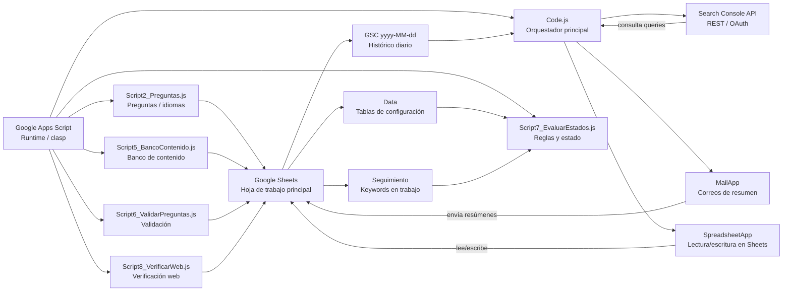

# Diagramas de arquitectura y flujo de trabajo

Este documento recoge dos visualizaciones del proyecto `keywords-gsc`: la relación entre componentes y el flujo de trabajo mensual del proceso.

## 1) Diagrama de relaciones entre componentes



### Descripción

- `Code.js` es el punto central del proyecto y orquesta la ejecución principal.
- La Hoja de cálculo Google Sheets actúa como base de datos operativa del sistema.
- La pestaña `Data` guarda las reglas, estados, configuración y catálogos que el script usa sin hardcodear datos de cada instalación.
- La pestaña `Seguimiento` es la vista operativa donde se guarda el estado de cada keyword y el trabajo manual.
- La pestaña `GSC yyyy-MM-dd` es un histórico por corrida, que conserva cada extracción del día.
- Los scripts complementarios (`Script2`, `Script5`, `Script6`, `Script7`, `Script8`) agregan comportamiento específico para preguntas, validación, banco de contenido, estados y verificación web.
- El sistema consulta Google Search Console por REST con OAuth, y luego escribe los resultados en Sheets y envía resúmenes por email.

---

## 2) Diagrama del flujo de trabajo

```mermaid
flowchart TD
    A[Trigger mensual\n1er día / 6:00-7:00] --> B[exportarKeywordsGSC()]

    B --> C[consultarSearchConsole_()]
    C --> D[Traer queries de los últimos 90 días]
    D --> E[Clasificar por oportunidad]
    E --> F[Ordenar por impresiones]
    F --> G[Tomar top N keywords]

    G --> H[Escribir pestaña GSC yyyy-MM-dd]
    G --> I[Actualizar Seguimiento]

    I --> J{¿La keyword ya existía?}
    J -->|No| K[Crear fila nueva\nEstado: Pendiente]
    J -->|Sí| L[Actualizar métricas GSC\nCategoría, impresiones, CTR, posición]

    K --> M[Revisión manual: volumen, competencia, notas, estado]
    L --> M

    M --> N[evaluarEstados()\nScript7]
    N --> O[Aplicar reglas de Data]
    O --> P[Actualizar Estado de filas]

    P --> Q[Verificar web\nScript8]
    Q --> R[Detectar if keyword está en página, meta y cuerpo]
    R --> S[Actualizar estado final y fechas]

    S --> T[Enviar resumen por email]
    T --> U[Fin del ciclo mensual]

    style A fill:#e8f5e9,stroke:#2e7d32
    style B fill:#e3f2fd,stroke:#1565c0
    style H fill:#fff3e0,stroke:#ef6c00
    style I fill:#fff3e0,stroke:#ef6c00
    style N fill:#f3e5f5,stroke:#7b1fa2
    style Q fill:#f3e5f5,stroke:#7b1fa2
    style T fill:#fce4ec,stroke:#c2185b
```

### Descripción del flujo

1. El sistema se dispara de forma mensual desde Apps Script.
2. `exportarKeywordsGSC()` consulta Search Console con OAuth y trae las consultas relevantes.
3. Las keywords se clasifican según impresiones, CTR y posición.
4. Se genera una hoja histórica por fecha y se sincroniza la pestaña `Seguimiento`.
5. El trabajo manual se hace para cada keyword: volumen, competencia y decisiones operativas.
6. `evaluarEstados()` aplica las reglas de Data para recalcular el estado de cada fila.
7. `Script8_VerificarWeb.js` comprueba si las keywords están realmente aplicadas en el sitio y en qué parte.
8. Finalmente, se envía un correo con el resumen por estado, cambios y enlaces útiles.

---

## Resumen ejecutivo

Este proyecto combina tres capas principales:

- Captura y clasificación de keyword data desde Google Search Console.
- Organización operativa en Google Sheets como herramienta principal de trabajo.
- Automatización y lógica de negocio en Apps Script para mantener y clasificar la información sin necesidad de un backend tradicional.

La estructura está pensada para reutilizarse en distintos sitios o empresas, dejando la configuración específica en `Script Properties` y `Data` y manteniendo el código central genérico.

```text
Proyecto: keywords-gsc
Tipo: Google Apps Script + Google Sheets
Integración externa: Search Console API + Google Mail + Web verification
Modo de operación: flujo mensual automatizado con revisión manual de keywords
```

Si quieres, puedo dejarte también una versión de este documento con estilo más formal para README o una versión con diagramas más compactos para presentación.
